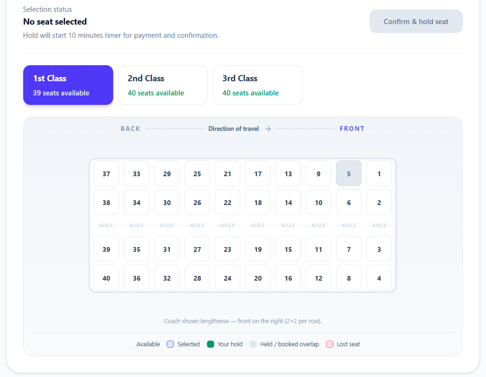
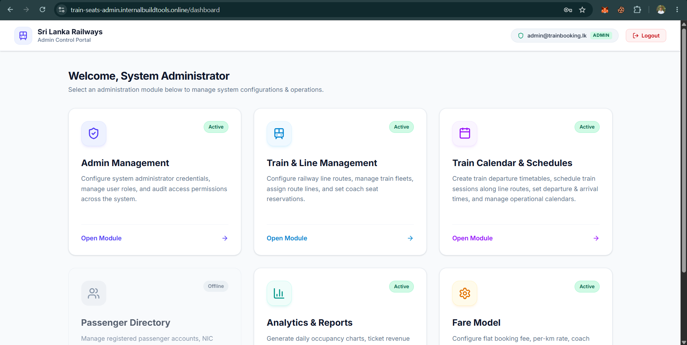
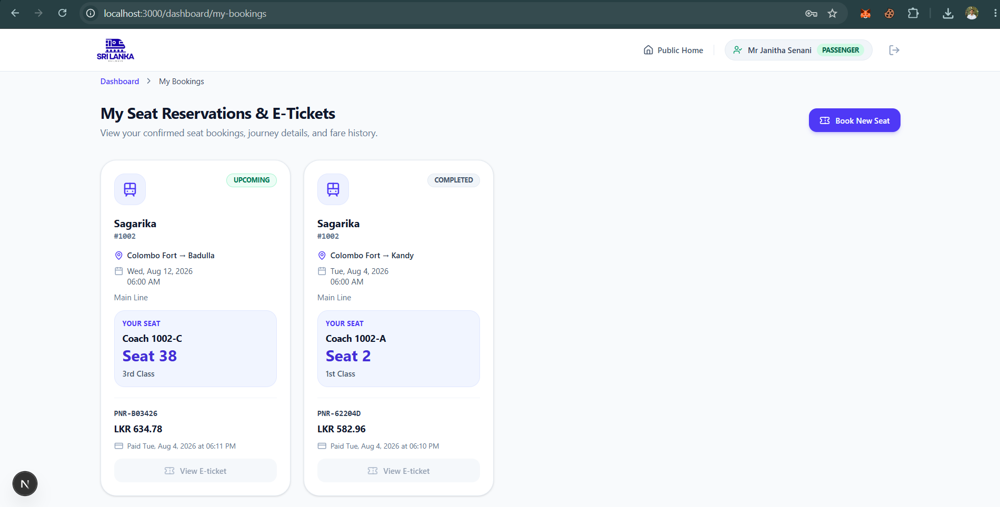
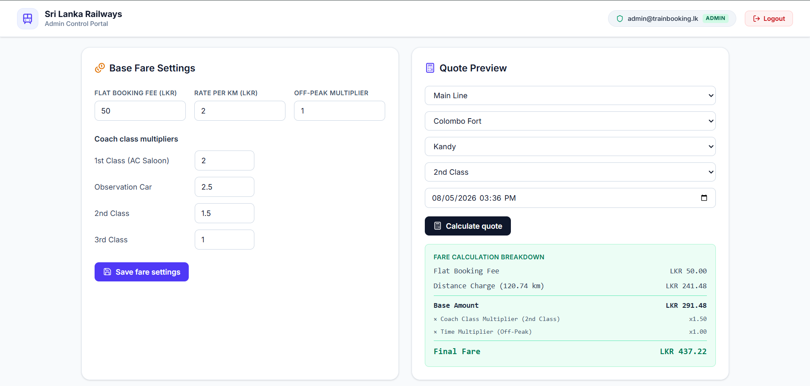
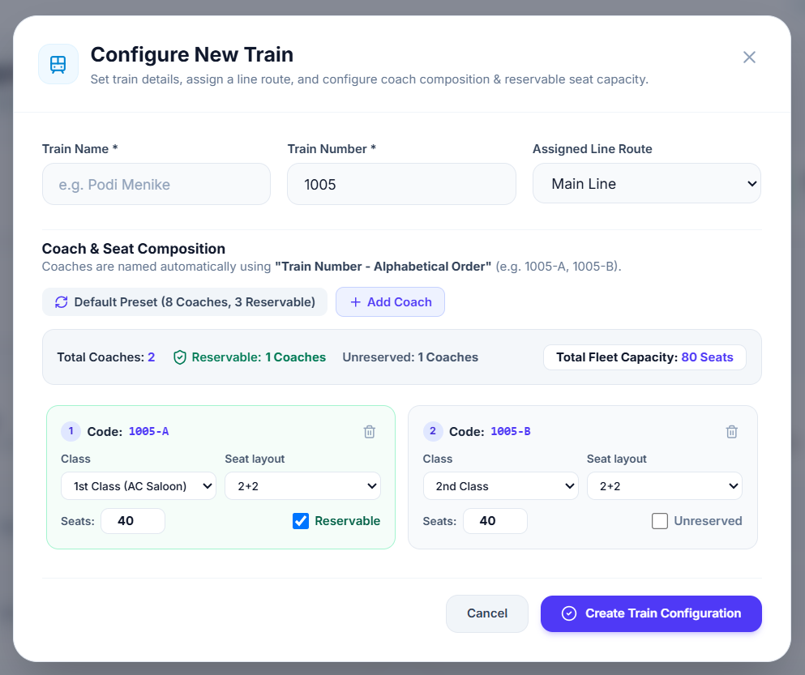
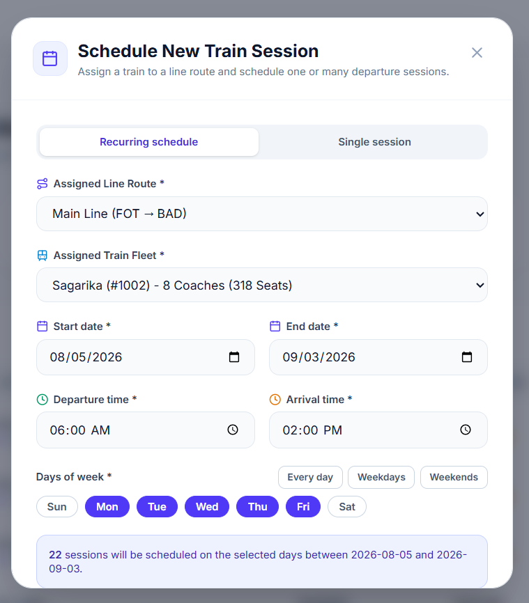

# Segment-Based Train Seat Booking (Colombo Fort - Badulla)

A train seat booking system for Sri Lanka’s Railway. A single reserved seat can be sold for multiple **non-overlapping** legs of the same journey, with each passenger charged only for the distance they travel.

## Live deployment

The database, backend API, passenger frontend, and admin frontend are deployed on an Ubuntu server:

| Service | URL |
|---------|-----|
| Passenger frontend | https://train-seats.internalbuildtools.online/ |
| Admin frontend | https://train-seats-admin.internalbuildtools.online/ |
| API documentation | https://train-seats-api.internalbuildtools.online/docs |

## Stack

| Layer | Tech |
|-------|------|
| API | NestJS 11, Prisma, PostgreSQL, Better Auth |
| Public client | Next.js 16 (App Router) |
| Admin | Vite + React |
| Infra | Docker Compose |

## Quick start

From a clean machine with only **Docker** installed:

```bash
git clone https://github.com/WebCooper/sri-lanka-train-seats-booking
cd sri-lanka-train-seats-booking
```

Create `.env` from the example, then set `BETTER_AUTH_SECRET` (any long random string):

**macOS / Linux**

```bash
cp .env.example .env
```

**Windows (PowerShell)**

```powershell
Copy-Item .env.example .env
```

**Windows (Command Prompt)**

```cmd
copy .env.example .env
```

Then start the stack (all platforms):

```bash
docker compose up --build -d
```

| Service | URL |
|---------|-----|
| Passenger Frontend | http://localhost:3000 |
| Administrator Frontend | http://localhost:5173 |
| Backend API Docs | http://localhost:5000/docs |

> Note: The only value you must set by hand in `.env` is `BETTER_AUTH_SECRET`. Everything else has working defaults for local Docker.

**Demo accounts**:

- Admin: `email` : `admin@trainbooking.lk` / `password` : `Admin123!`
- Passenger:  `email` : `passenger@example.com` / `password` : `Passenger123!`

## Project layout

```
├── backend/          # NestJS API, Prisma schema, migrations, seed
├── web/              # Next.js passenger app 
├── admin/            # Vite + React admin dashboard
├── figures/          # README screenshots
├── docker-compose.yml
└── .env.example
```

## Core design decisions

### 1. Separate passenger and admin frontends

The passenger app (`web/`) and admin app (`admin/`) are independent projects with their own builds and deploy targets. An admin change does not rebuild the passenger side, and passenger updates do not affect the admin side.

**Why:** Admin and passenger UIs have different goals. SEO-friendly public booking is needed for passengers. Admins are only using the UI as operational tooling. Splitting them keeps bundle sizes small, avoids shipping admin code to passengers, and lets each app evolve on its own release cycle.

**Alternatives considered:**
- **Single Next.js app with `/admin` routes** - simpler repo layout, but couples releases and ships admin JavaScript to all visitors.
- **One Vite SPA for everything** - fast to build, but poor SEO for the public booking journey.

### 2. Next.js for passengers, Vite + React for admin

Passengers need discoverable pages (routes, stations, contact). Next.js App Router gives server side rendering and static generation for those surfaces. The admin dashboard is authenticated-only and prioritizes fast iteration and rich forms. Vite + React fits that without SSR overhead.

**Alternatives considered:**
- **Next.js for both** - viable, but admin would inherit Next.js complexity it does not need.
- **Vite for both** - simpler stack, but weaker default SEO for public pages.

### 3. NestJS for the API

NestJS provides structured modules, dependency injection, and end-to-end TypeScript from DTOs through services to Prisma. That scales cleanly as admin, passenger, and reporting endpoints grow.

**Alternatives considered:**
- **Express/Fastify with loose handlers** - lighter initially, but harder to keep consistent validation and module boundaries as the API grows.
- **Next.js API routes only** - would tie the API to the passenger frontend deploy.

### 4. Better Auth for authentication

Better Auth is database-agnostic and runs inside the NestJS backend. Sessions, users, and roles live in our PostgreSQL schema. No third party auth vendor or external session store.

**Alternatives considered:**
- **Auth0 / Firebase Auth** - faster to wire up, but adds vendor dependency, cost, and less control over session and role data.
- **Passport.js only** - flexible, but more manual work for session management, adapters, and client integration.

### 5. Segment-based occupancy model

Each booking leg is a **half-open interval** along the line: Colombo Fort → Kandy is `[originIndex, destinationIndex)`. A passenger alighting at Kandy (index 5) and another boarding at Kandy for Badulla (index 5 → 10) do not overlap.

Overlap detection uses: `existingStart < requestedEnd && requestedStart < existingEnd`.

**Alternatives considered:**
- **Application-level locking only** - have race conditions under concurrent holds. Therefore rejected for production use.

### 6. Concurrency and conflict handling

Overlapping segments on the same seat are rejected **atomically at the database** using a PostgreSQL GiST exclusion constraint. Even if two requests pass application checks simultaneously, only one insert succeeds.

The API also expires stale holds before availability checks and maps constraint violations to clear 409 responses.

**Alternatives considered:**
- **Optimistic locking with version columns** - workable but still allows brief double-hold windows; DB exclusion is stricter.
- **Redis distributed locks** - adds another service; PostgreSQL already owns the authoritative state.

### 7. Fare model

Fare = `(flat booking fee + distance × rate per km) × coach class multiplier × peak/off-peak multiplier`.

Peak windows are configurable rules (time range + days of week). Admin can adjust base rates, coach multipliers, and peak rules without code changes.

**Alternatives considered:**
- **Flat distance-only pricing** - meets the minimum spec but ignores class and demand patterns common on real railways.
- **Hard-coded fare tables per station pair** - accurate but painful to maintain as lines or rates change.

### 8. Passenger booking flow

Login → select origin, destination, and date → search schedules with available seats → open seat map → select seat (starts hold timer) → see fare quote → demo payment → booking confirmed for that coach seat on that schedule leg.

## Extra credit features

### 1. Seat map visualization

**Problem:** A list of seat numbers does not match how passengers think about a coach.

**Solution:** A visual coach layout renders rows by coach configuration (e.g. 2+2 or 2+3), with colour states for available, selected, holding, occupied, and lost. Layout metrics adapt to coach class and orientation.



### 2. Admin analytics dashboard

**Problem:** Operations staff need occupancy and revenue insight.

**Solution:**  revenue over time, revenue by coach class and schedule, and **segment efficiency** (multi-segment seat reuse, average segments per seat, revenue captured from segment reuse).



### 3. Conflict-aware booking UI

**Problem:** Under concurrency, users can select a seat that was just taken. The UI must communicate that clearly.

**Solution:** Before starting a hold, the client refreshes availability. If the seat is gone, it shows a **lost** state on the map and an error message. While a hold is active, a countdown timer runs. On expiry the hold clears and the map refreshes. Background polling and focus-based refresh keep availability close to real time without WebSockets.


& 


### 4. Passenger booking history

**Problem:** After booking, passengers need a single place to see reserved seats, trip details, and access their e-tickets.

**Solution:** A **My Seat Reservations & E-Tickets** dashboard (`/dashboard/my-bookings`) lists every booking with status badges (**Upcoming** vs **Completed**), train and route details, coach, seat number, class, PNR, fare, and payment timestamp. A **Book New Seat** action starts another reservation from the same page.



### 5. Fare logic beyond distance-based pricing

**Problem:** Simple per-km pricing ignores coach class and peak demand.

**Solution:** Configurable flat fee, per-km rate, per-coach-class multipliers, and peak-hour rules with day-of-week filters. Passengers see a full quote breakdown; admins manage the model and run test quotes from the Fare Model module.



### 6. Train and coach configuration UI

**Problem:** Defining a new train fleet with multiple coaches and class, seat layout, capacity, and reservable vs unreserved.

**Solution:** A **Configure New Train** modal in the admin portal that handles train identity, line route assignment, and full coach composition in one screen. Coaches are named automatically (`1005-A`, `1005-B`, …). Each coach card sets class (e.g. 1st Class, 2nd Class), seat layout (2+2), seat count, and whether it is reservable. A **Default Preset** applies a standard 8-coach layout in one click; **Add Coach** builds custom compositions. A live summary bar shows total coaches, reservable vs unreserved split, and fleet capacity before creation.



### 7. Recurring train schedule UI

**Problem:** Scheduling the same train on a route day after day requires creating each session one at a time. It is tedious for daily or weekday express services.

**Solution:** A unified **Schedule New Train Session** modal in the admin portal with a **Recurring schedule** tab. Pick the line route and train fleet, set a date range, departure and arrival times, and select days of the week (with quick presets for every day, weekdays, or weekends). The UI previews how many sessions will be created before submission. E.g. 22 weekday sessions across a month in one action.



## Challenges

- **GiST exclusion with Prisma** - Prisma does not model exclusion constraints natively; the constraint is applied via raw SQL migration while the app writes `origin_position` / `destination_position` from line geometry in code.
- **Correct adjacent-segment semantics** - half-open intervals must align with station ordering on the line; index bugs would either block valid adjacent bookings or allow silent overlaps.
- **Hold expiry under load** - holds must expire reliably and free inventory before the next availability read; stale holds are swept on read and on a schedule-driven expiry update.
- **Real-time feel without WebSockets** - the seat map polls every 7s and refreshes on window focus, with explicit loading, hold countdown, and “seat lost” states when a competitor takes a seat first.
- **Past-departure booking and timezone-aware search** - schedule search originally matched only the selected calendar day (`departureTime` between midnight and end of day) without comparing against the current time. A train that departed at 6:00 AM could still appear in search results and be booked at 6:00 PM on the same day. The fix clamps the search lower bound to `now` when the requested date is today (or in the past), and rejects seat holds when `departureTime` has already passed. A related issue was that day boundaries were computed in UTC (`setUTCHours`), shifting the Colombo calendar day by 5.5 hours - e.g. searching “Aug 4” matched `00:00–23:59 UTC` instead of the local `00:00–23:59 +05:30` window. Day boundaries are now anchored to Asia/Colombo’s fixed `+05:30` offset so a searched date aligns with the local calendar day.