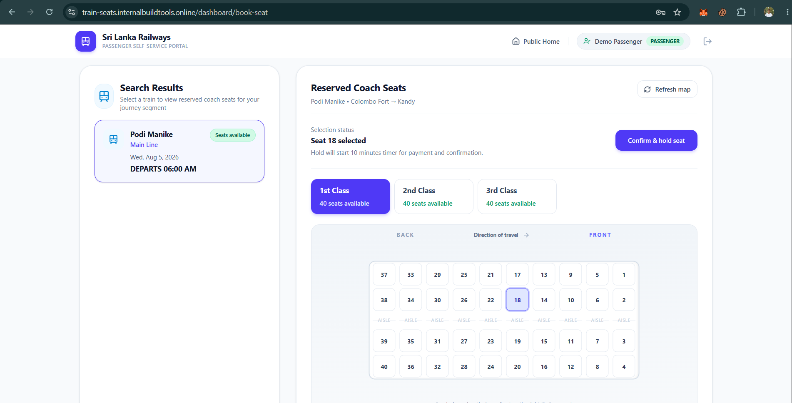
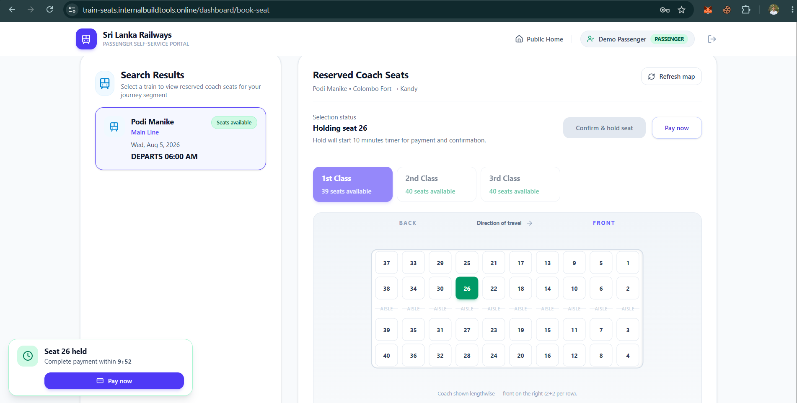

# Segment-Based Train Seat Booking — Colombo Fort–Badulla

A production-minded booking system for Sri Lanka’s scenic Colombo Fort–Badulla line. A single reserved seat can be sold for multiple **non-overlapping** legs of the same journey, with each passenger charged only for the distance they travel.

## Stack

| Layer | Tech |
|-------|------|
| API | NestJS 11, Prisma, PostgreSQL, Better Auth |
| Public client | Next.js 16 (App Router) |
| Admin | Vite + React |
| Infra | Docker Compose |

## Quick start

From a clean machine with only **Docker** installed:

```bash
git clone https://github.com/WebCooper/sri-lanka-train-seats-booking
cd sri-lanka-train-seats-booking
cp .env.example .env          # then set BETTER_AUTH_SECRET (any long random string)
docker compose up --build -d
```

That single command is fully self-contained:

1. **postgres** starts and becomes healthy.
2. **migrate** runs `prisma migrate deploy` to create all tables, then seeds stations and the fare model, a demo passenger, a demo administrator and exits.
3. **backend**, **admin**, and **web** start only after the migration & seed completes.

No manual `prisma migrate` / `prisma db push` step is required.

| Service | URL |
|---------|-----|
| Passenger Frontend | http://localhost:3000 |
| Administrator Frontend | http://localhost:5173 |
| Backend API Docs | http://localhost:5000/docs |

> The only value you must set by hand in `.env` is `BETTER_AUTH_SECRET`. Everything else has working defaults for local Docker.

**Demo accounts** (seeded):

- Admin: `admin@trainbooking.lk` / `Admin123!`
- Passenger: `passenger@example.com` / `Passenger123!`

### Local development (without Docker for apps)

1. Start Postgres: `docker compose up postgres -d`
2. Backend: `cd backend && npm install && npx prisma migrate deploy && npx prisma db seed && npm run start:dev`
3. Web: `cd web && npm install && npm run dev`
4. Admin: `cd admin && npm install && npm run dev`

## Project layout

```
├── backend/          # NestJS API, Prisma schema, migrations, seed
├── web/              # Next.js passenger app (booking, auth, SEO pages)
├── admin/            # Vite + React admin dashboard
├── figures/          # README screenshots
├── docker-compose.yml
└── .env.example
```

## Core design decisions

### Separate passenger and admin frontends

The passenger app (`web/`) and admin app (`admin/`) are independent projects with their own builds and deploy targets. An admin change does not rebuild the passenger side, and passenger updates do not affect the admin side.

**Why:** Admin and passenger UIs have different goals — SEO-friendly public booking vs. dense operational tooling. Splitting them keeps bundle sizes small, avoids shipping admin code to passengers, and lets each app evolve on its own release cycle.

**Alternatives considered:**
- **Single Next.js app with `/admin` routes** — simpler repo layout, but couples releases and ships admin JavaScript to all visitors.
- **One Vite SPA for everything** — fast to build, but poor SEO for the public booking journey.

### Next.js for passengers, Vite + React for admin

Passengers need discoverable pages (routes, stations, contact). Next.js App Router gives server rendering and static generation for those surfaces. The admin dashboard is authenticated-only and prioritises fast iteration and rich forms — Vite + React fits that without SSR overhead.

**Alternatives considered:**
- **Next.js for both** — viable, but admin would inherit Next.js complexity it does not need.
- **Vite for both** — simpler stack, but weaker default SEO for public pages.

### NestJS for the API

NestJS provides structured modules, dependency injection, and end-to-end TypeScript from DTOs through services to Prisma. That scales cleanly as admin, passenger, and reporting endpoints grow.

**Alternatives considered:**
- **Express/Fastify with loose handlers** — lighter initially, but harder to keep consistent validation and module boundaries as the API grows.
- **Next.js API routes only** — would tie the API to the passenger frontend deploy.

### Better Auth for authentication

Better Auth is database-agnostic and runs inside the NestJS backend. Sessions, users, and roles live in our PostgreSQL schema — no third-party auth vendor or external session store.

**Alternatives considered:**
- **Auth0 / Firebase Auth** — faster to wire up, but adds vendor dependency, cost, and less control over session and role data.
- **Passport.js only** — flexible, but more manual work for session management, adapters, and client integration.

### Segment-based occupancy model

Each booking leg is a **half-open interval** along the line: Colombo Fort → Kandy is `[originIndex, destinationIndex)`. A passenger alighting at Kandy (index 5) and another boarding at Kandy for Badulla (index 5 → 10) do not overlap.

Overlap detection uses: `existingStart < requestedEnd && requestedStart < existingEnd`.

Holds and confirmed bookings are stored as `seat_segment_allocation` rows tied to a schedule, coach, and seat — passenger booking data stays separate from inventory state.

**Alternatives considered:**
- **Application-level locking only** — have race conditions under concurrent holds. Therefore rejected for production use.

### Concurrency and conflict handling

Overlapping segments on the same seat are rejected **atomically at the database** using a PostgreSQL GiST exclusion constraint (`seat_segment_allocation_no_overlap` with `btree_gist`). Even if two requests pass application checks simultaneously, only one insert succeeds.

The API also expires stale holds before availability checks and maps constraint violations to clear 409 responses.

**Alternatives considered:**
- **Optimistic locking with version columns** — workable but still allows brief double-hold windows; DB exclusion is stricter.
- **Redis distributed locks** — adds another service; PostgreSQL already owns the authoritative state.

### Fare model

Fare = `(flat booking fee + distance × rate per km) × coach class multiplier × peak/off-peak multiplier`.

Peak windows are configurable rules (time range + days of week). Admin can adjust base rates, coach multipliers, and peak rules without code changes.

**Alternatives considered:**
- **Flat distance-only pricing** — meets the minimum spec but ignores class and demand patterns common on real railways.
- **Hard-coded fare tables per station pair** — accurate but painful to maintain as lines or rates change.

### Passenger booking flow

Login → select origin, destination, and date → search schedules with available seats → open seat map → select seat (starts hold timer) → see fare quote → demo payment → booking confirmed for that coach seat on that schedule leg.

## Challenges

- **GiST exclusion with Prisma** — Prisma does not model exclusion constraints natively; the constraint is applied via raw SQL migration while the app writes `origin_position` / `destination_position` from line geometry in code.
- **Correct adjacent-segment semantics** — half-open intervals must align with station ordering on the line; index bugs would either block valid adjacent bookings or allow silent overlaps.
- **Hold expiry under load** — holds must expire reliably and free inventory before the next availability read; stale holds are swept on read and on a schedule-driven expiry update.
- **Real-time feel without WebSockets** — the seat map polls every 7s and refreshes on window focus, with explicit loading, hold countdown, and “seat lost” states when a competitor takes a seat first.

## Extra credit features

### Seat map visualization

**Problem:** A list of seat numbers does not match how passengers think about a coach.

**Solution:** A visual coach layout (`web/components/SeatMap.tsx`) renders rows by coach configuration (e.g. 2+2), with colour states for available, selected, holding, occupied, and lost. Layout metrics adapt to coach class and orientation.



### Admin analytics dashboard

**Problem:** Operations staff need occupancy and revenue insight, not just CRUD screens.

**Solution:** An admin hub (`admin/`) with modules for trains, schedules, fare model, and **Analytics & Reports** — revenue over time, revenue by coach class and schedule, and **segment efficiency** (multi-segment seat reuse, average segments per seat, revenue captured from segment reuse).


### Conflict-aware booking UI

**Problem:** Under concurrency, users can select a seat that was just taken; the UI must communicate that clearly.

**Solution:** Before starting a hold, the client refreshes availability. If the seat is gone, it shows a **lost** state on the map and an error message. While a hold is active, a countdown timer runs; on expiry the hold clears and the map refreshes. Background polling and focus-based refresh keep availability close to real time without WebSockets.



### Fare logic beyond distance-based pricing

**Problem:** Simple per-km pricing ignores coach class and peak demand.

**Solution:** Configurable flat fee, per-km rate, per-coach-class multipliers, and peak-hour rules with day-of-week filters. Passengers see a full quote breakdown; admins manage the model and run test quotes from the Fare Model module.


**Not implemented:** Waitlisting for fully booked segments — prioritised seat-map accuracy, admin reporting, and conflict-safe holds instead.
